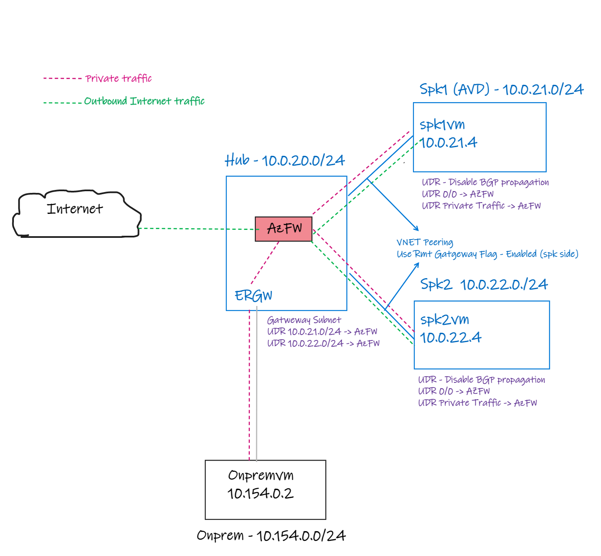
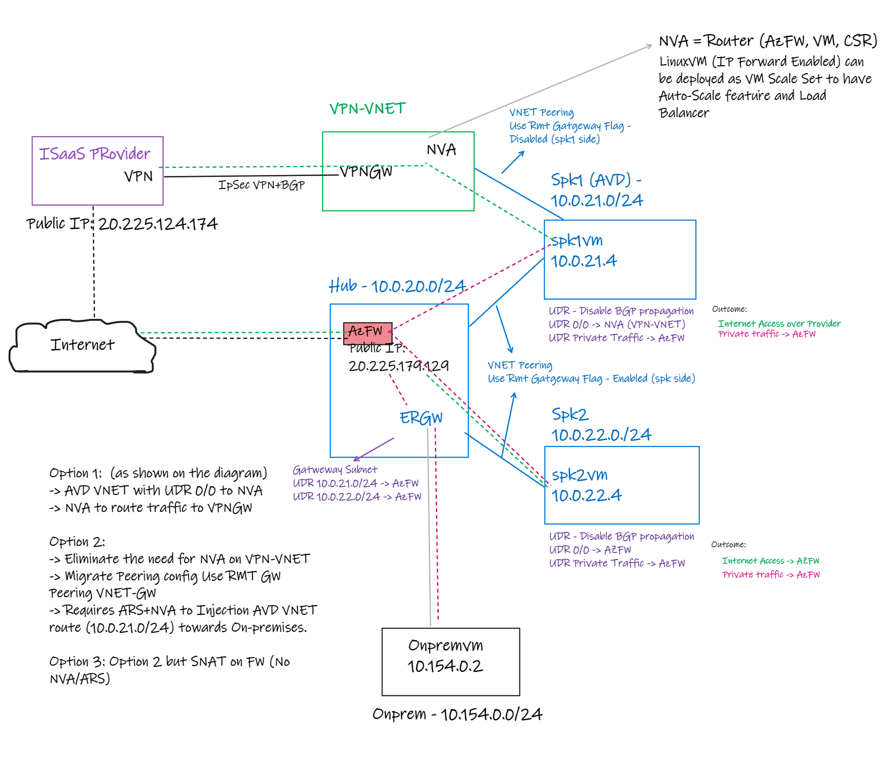

# VPN with ER and Internet Breakout via VPN

### Scenario

Contoso has a requirement to have a internet breakout from AVD environment to going over a 3rd party Internet Security as a Service (ISaaS) provider. That connectivity integration with ISaaS provider and Azure is done over S2S VPN.

### Requirements

1. Spoke 1 AVD Networking Breakout should go over the ISaaS to get its traffic inspected.
2. Spoke 2 and other Spoke future connected spokes should breakout Internet using Azure Firewall

### Current setup

Contoso currently has ExpressRoute connection to On-premises DataCenter and also an Azure Firewall for Private and Internet traffic as shown:

### Considerations

It would be possible without Firewall to add an extra VPN Gateway coexisting with ExpressRoute and receive 0/0 propagation.

However, when using the firewall an UDR is required to send the traffic from On-premises to the target VNETs. Because ER and VPN share the same GatewaySubnet and there is a UDR in place. Therefore, the return traffic from VPN Gateway will go back via Azure Firewall causing asymmetry traffic impacting and dropping the communication. The diagram below shows the issue which affects return Internet traffic coming from ISaaS provider

### Solution

There are three potential solutions for overcome the requirements:

1) Create a new VPN-VNET with VPN Gateway and add NVA to facilitate the routing with Spk1 (AVD) VNET.
- VNET peering from AVD VNET to VPN-VNET with use remote gateway flag disable on the Spk1 peering side.
- VNET Peering from AVD VNET to Hub with use remote gateway flag enabled. That will allow Spk1 VNET to get propagated down to ER.
- On Spk1 (AVD) VNET Configure UDR:
 - Gateway propagation disabled.
 - Default route 0.0.0.0/0 to NVA in the VPN-VNET.
 - Private traffic next hop AzFW.

2) Create a new VPN-VNET with VPN Gateway (no NVA needed)
- VNET peering from AVD VNET to VPN-VNET with use remote gateway flag ENABLED on the Spk1 peering side.
- VNET Peering from AVD VNET to Hub with use remote gateway flag DISABLED.
- On Spk1 (AVD) VNET Configure UDR:
 - Gateway propagation enabled. That will allow AVD to learn default route from VPN Gateway in case it is getting propagated by BGP.
    - For forced tunnel scenario with VPN GW (add link here) you add UDR 0/0 and next hop Virtual Network Gateway
 - VNET to use default route 0.0.0.0/0 to NVA in the VPN-VNET
 - VNET to use private
- Add NVA + ARS to inject 10.0.21.0/24 to allow ER propagate the route down to On-premises.

3) Same as 2 option but no NVA or ARS
- SNAT traffic over Azure Firewall.

### Solution diagram

The diagram below shows solution 1. The other solutions will be added in the future.

Deploy this solution by using 

### References

Prima Access - Onboard an Azure Virtual Network
- https://docs.paloaltonetworks.com/prisma/prisma-access/prisma-access-panorama-integration/secure-your-public-cloud-deployment-with-prisma-access/onboard-azure-vnet
